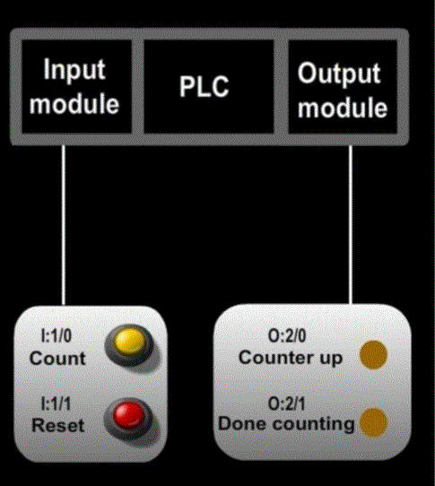
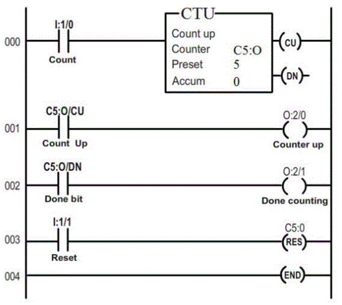
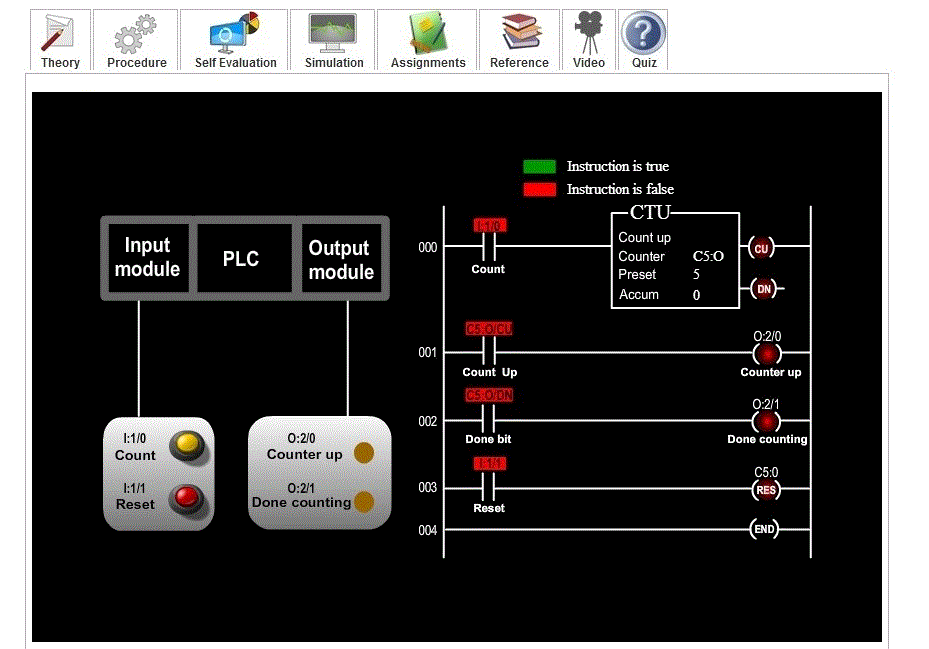
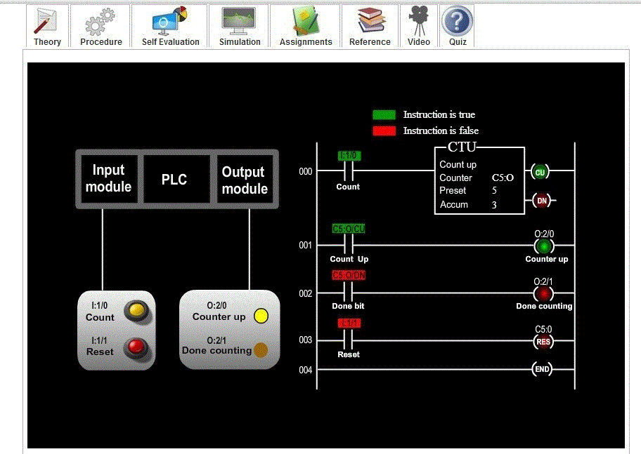
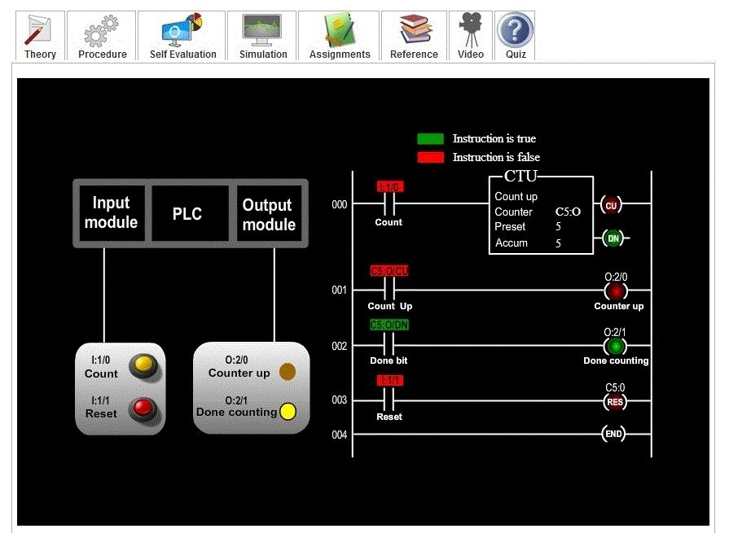

### Aim of the experiment: PLC Count-up Instruction

### Aim :

To understand the working of a count up instruction in a Programmable Logic Controller.

### Procedure :

<strong>Procedure</strong>: In our experiment, we wish to demonstrate the working of count-up instruction (up counter).  
The fig below shows the set up. 

<ul type=disc style="text-align: justify;">
<li>Since inputs and outputs are less, 8-point Input and 8-point output module is sufficient. Where, CPU resides in slot 0, input module resides in slot 1, and output module in slot 2. </li>

<li> Here, two inputs are taken, one for counting and other for resetting the counter. Two push button of normally open type are used for this purpose. Also, 2 LED’s are used as output, to display the status of the counter. Counter up LED glows during counting (the moment count push button is pressed) and Done counting LED glows when the counter is done counting( i.e accumulator is greater than or equal to preset value). </li>

<li>Let us assign address for the input and output signals of the PLC.   
&#10147; Count ( normally open push button ) = I:1/0  
&#10147; Reset (normally open push button ) = I:1/1   
&#10147; Count up (LED) = O:2/0   
&#10147; Done counting ( LED ) = O:2/1   
&#10147; C5:0/CU = count-up enable bit  
&#10147; C5:0/DN = done bit   </li>

<li>Fig below shows the ladder diagram:  

</li>

<li>In order to see how the counter instruction in a PLC works, click count push button and observe the counter instruction and counter up LED. When the counter is done counting, its status is displayed using Done counting LED. Once the counter is done counting, it can be reset using reset push button.
</li>
</ul>

The following screen shots explains the operation :

 
The above screen shot represents the default condition or the condition after resetting the counter. 

 
The above screen shot represents the default condition or the condition after resetting the counter. 

 
The above screen shot represents the condition when the counter is done counting.

